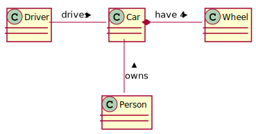

<h1><p style="text-align: center;">How To Write A Document</p></h1>

Table of content:
[TOC]

## Overview
This document is an reference about how to write a document in this repository. 
If you are new to this project and you are editing a document, please keep this document opening.
    


## Create An Document
The first step for creating an document is creating a folder for this document under `src/main/resources/markdown` 
or its sub folder. The name of this folder should reflect the subject of the document and match regular expression
`^[a-z|A-Z|0-9|_]*$`. For example, the folder name for this document is "how_to_write_doc". This folder should
include all material for this document. Such as, markdown files, CSS files and images.

After the folder is created, an markdown document(suffix is ".md") with the same name should be created in this folder.
For example, a "how_to_write_doc.md" file is created for this document. This file is the entry point for the whole 
document. If there is too much content for a document, other "md" files can be created and they can be linked with 
hyperlink. However, this approach is not recommended because the "table of content" `[TOC]` will not be translated
properly.

## How To Use Markdown
### Why Markdown Is Used
Markdown is a lightweight markup language with plain text formatting syntax. Markdown is choose as documentation 
format because:

* The data of markdown document is stored in text format. It is very version control system friendly. Once an version
 control system is used to trace all adjustments, people do not need to use colors to highlight the parts that they
 have adjusted as they did for MS words document.
* Markdown is very simple. It is easy to read and edit. Furthermore, it is simple enough for people to learn the 
  syntax soon. 
* It is different from MS words that user need to use mouse to choose texts and change the format of those texts by 
  clicking some buttons or menu items. In Markdown, user only need to use keyboard to type something to mark the
  texts. This approach can improve the productivity of documentation.
* Markdown is very popular. There are many editors are available in all platform. 
* Markdown can be translated into other format(such as, HTML) easily. That means, it is very easy to distribute 
 documents that are written in Markdown.
 

### Syntax Reference
To illustrate how the rendered result looks like in a document after they are translated by tool 
in this repository, this section show examples for syntax used often. 
Please use this section as a syntax reference when you create a document in this repository.

For more detail information about markdown syntax, please refer [markdown guide](https://www.markdownguide.org/)
 

#### Header

A header can be create as below:
```markdown

Level 1 header
=================

Level 2 header
-----------------

```
The example above looks like:
><h1>Level 1 header</h1>
><h2>Level 2 header</h2>


This approach only can be used to defined first level and second leve headers. A better approach is
```markdown

# Level 1 header

## Level 2 header

### Level 3 header

#### Level 4 header

##### Level 5 header

###### Level 6 header

```
The example above looks like:

><h1>Level 1 header</h1>
>
><h2>Level 2 header</h2>
>
><h3>Level 3 header</h3>
>
><h4>Level 4 header</h4>
>
><h5>Level 5 header</h5>
>
><h6>Level 6 header</h6>


#### Paragraphs
To create paragraphs, use a blank line to separate one or more lines of text. For example:
```markdown
This is the first paragraphs.

This is the second paragraphs.
```
The example above looks like:

>This is the first paragraphs.
>
>This is the second paragraphs.


#### Emphasis
Texts can be made to bold or italic. Below are examples:

| emphasis    |   markdown         | rendered output |
|-------------|--------------------|-----------------|
|  bold       | `**bold**`         | **bold**       |
|  bold       | `__bold__`         | __bold__       | 
|  italic     | `*italic*`         | *italic*        |
|  italic     | `_italic_`         | _italic_        |
|bold & italic| `***italic***`     | ***italic***    |
|bold & italic| `___italic___`     | ___italic___    |
|Strikethrough| `~~Strikethrough~~`|~~Strikethrough~~|


#### Blockquotes
Use `>` to create a blockquote. Below are examples:
```markdown
A blockquote has one paragraphs
> A paragraphs in a blockquote.
This is the second sentence of the paragraphs.

A blockquote has two paragraphs
> Two paragraphs in a blockquote. This is the first paragraphs.
>
> This is the second paragraphs.

```
The example above looks like:
> A blockquote has one paragraphs.
> > A paragraphs in a blockquote.
>   This is the second sentence of the paragraphs.
>   
> A blockquote has two paragraphs.
> > Two paragraphs in a blockquote. This is the first paragraphs.
> >
> > This is the second paragraphs.

####Lists
`*`, `+`, `-` can be used to create unordered list and `numbers` + `.` can be used to creatged ordered list.
For examples:
```markdown
Below is an unordered list:

* item 1
+ item 2
- item 3

Below is an ordered list:

1. item 1
3. item 2
1. item 3
2. item 4
```
The example above is rendered as below:
>Below is an unordered list:
>
>* item 1
>+ item 2
>- item 3
> 
>Below is an ordered list:
>
>1. item 1
>3. item 2
>1. item 3
>2. item 4

#### Codes
` `` ` Can be used to embeded code in one line. Below is an example:
```markdown
Java use `System.out.println()` method to output message.
``` 
The example above will be rendered as:
>Java use `System.out.println()` method to output message.
 
 ` ```{programming language name} ... ``` ` can be used to 
create a fenced code block. This is very useful in case some coding example should be shown in a document. 
For example:


<pre><code>

\```java

@Service
public class UserService {
  ``
  private static final Logger LOG = LoggerFactory.getLogger(UserService.class);

  @Autowired
  UserRepository userRepository;

  @Autowired
  JpaRestPaginationService jpaRestPaginationService;
    
  @ReadOnlyTransaction
      public UserDetailView getUser(String userName) {
      ...
  }
  ...   
}  
\```
</code></pre>

the document will show:
>```java
>@Service
>public class UserService {
>
>    private static final Logger LOG = LoggerFactory.getLogger(UserService.class);
>
>    @Autowired
>    UserRepository userRepository;
>
>    @Autowired
>    JpaRestPaginationService jpaRestPaginationService;
>    
>    @ReadOnlyTransaction
>    public UserDetailView getUser(String userName) {
>        ...
>    }
>    ...   
>}    
>
>``` 

#### Table
Markdown also support table as HTML. Below is an example:
```markdown
|   No alignment     |   Align to right   |   Align to left    |   Align to center    |
|--------------------|-------------------:|:-------------------|:--------------------:|
|   Text             |  Number            |      Date          |2012&#124;12&#124;30  |
|   Text             |  Number            |      Date          |2012&#124;12&#124;29  |
```

The example above is rendered as below:

|   No alignment     |   Align to right   |   Align to left    |   Align to center    |
|--------------------|-------------------:|:-------------------|:--------------------:|
|   Text             |  Number            |      Date          |2012&#124;12&#124;30  |
|   Text             |  Number            |      Date          |2012&#124;12&#124;29  |

#### Image
To embeded an image into a document, the image file(can be jpg, png, svg or whatever format
can be supported by browser) should be placed under the document folder or it's subfolder
(please refer [How To Create A Document](#create-an-document) ).
Then, use '' (image alt text is the text will be placed 
at the alt tag for a  in HTML) to embed an image in a document.
For example:
```markdown

```
The example above is rendered as below:
> 

#### Horizontal Line
To create horizontal line, use three or more '*', '-' or '_' in one line.
For example:
```markdown
***
-----
_______

```

The example above is rendered as below:

***
-----
_______


#### Links
To create a link, `[item will be shown in document](url for the link)` can be used. For example:
```markdown
[link to bing](http://www.bing.com)

[](https://www.linux.com/)

```
The example above is rended as below:
> [link to bing](http://www.bing.com)
>
> [](https://www.linux.com/)

`< url or email address >` also can be used to create links. For example:
```markdown
<https://stackoverflow.com/>

<abc@gmail.com>
```

The example above is rendered as below:
> <https://stackoverflow.com/>
>
> <abc@gmail.com>

### Syntax Exercise
If you want to do some exercises for markdown, please access [Markdown Tutorial](https://www.markdowntutorial.com/)

## Document Generation
After all markdown files and other materials are ready, they can be used to generate the document. First of all, 
because this repository is managed with maven, please make sure maven has been installed. Please refer 
[maven install doc](http://maven.apache.org/install.html). Once maven is ready, you can run command 
`mvn compile` to generated documents and all documents can be found under `target/site/html` folder.

This repository use flexmark plugin to generate HTML document. Please refer 
[vsch maven plugin](https://github.com/vsch/markdown-page-generator-plugin) in case you need to change 
settings for document generation.


## UML Diagram
UML is used often to illustrate a software design. In this repository, plantuml is used to draw UML diagram. Just like
markdown, plantuml files are plant text files so that they are very version control system friendly. Furthermore, 
author can focus on what they want to express in UML diagram but not something like elements size or elements position.
Below is an example of plantuml.


The UML above looks like:



To use plantuml diagram in a document, first of all, a file with naming convention 
'*.puml' (such as abc.puml) should be created. The plantuml codes should be stored in this file.
Then, use ``(all puml file will be converted to svg image format in this repository. For more 
detail info, please refer the 'plantuml-maven-plugin' plugin in pom.xml file) to embeded this file into document.
After all materials are ready, run `mvn compile`. The puml files will be converted into svg image files so that they 
can be shown in documents.

For the syntax of plantuml, please refer [planuml website](http://plantuml.com/sitemap-language-specification).
Actually, you do not need to memorize the syntax. You just need to open that web site and choose the type of diagram 
you are working on. Then, this web site will provide a lots of example you can copy.

To make plantuml work, graphviz must be installed. Please refer 
[graphviz installation](http://plantuml.com/graphviz-dot) about how to install in. Please note that, to make sure the 
maven plugin know where the graphviz has been installed, environment variable `GRAPHVIZ_DOT` must be set properly. 
It should point to the `dot` executable command. For example, `d:\graphviz\dot.exe`.

_____________ 