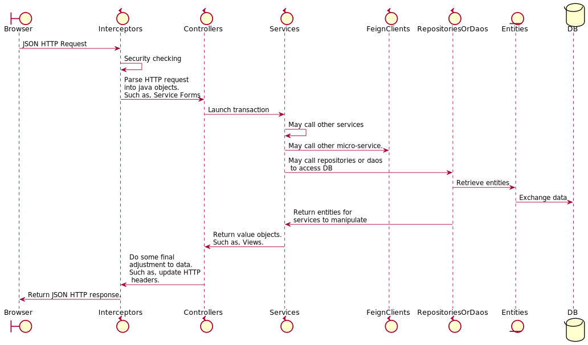
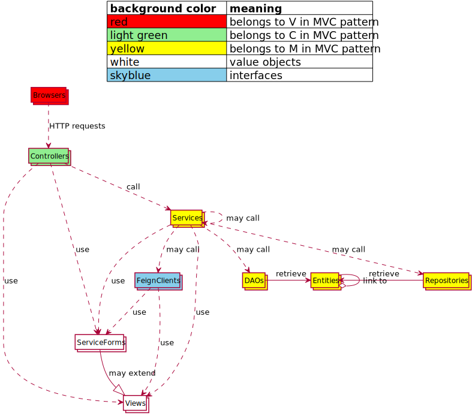

<h1><p style="text-align: center;">Backend Programming Guide</p></h1>

Table of content:
[TOC levels=2-4]

## Overview
This document introduce technical detail about backend programming. It introduce how to implement each
type of technical components and coding standard. Developers who are new to this project should go through
this document first before doing any backend service development tasks.


## Components For Tasks 

When developer want to create a new backend service for new functions, below types of technical components 
will be touched:

* Controllers - Controllers are used to expose HTTP REST endpoints that can be accessed by other services or frontend
program. It implement the C layer of MVC pattern. Usually, it call Services to conduct transactions or retrieve data.
It may transform the data that is retrieved from Services into a format that can be understood by the caller 
(such as an browser based frontend application). Usually, Controllers accept request or generate response in JSON
 format(except for the scenarios that need to handle binary data. Such as file upload, generate PDF).
* Services - Services are used to implement business logic. It call other Services, Repositories or DAOs to manipulate 
data in DB. Transaction control should be done in this layer. 
* Repositories - Spring data is used in this project. Compare with traditional DAOs, Spring data can save effort if
developer just need some simple DB access method. For example, Spring data can provide repositories with default 
CRUD method for one entity. Developer do not need to code any implementation. Spring data
also can generate implementation for simple query method for one entity by parsing method names. Developer just need 
to define that method in repositories interface. Spring data repositories only can be used to do DB access for one
entity only.
* DAOs - In some scenarios, complicated DB access is needed for some reasons. For example, some query functions may 
have performance issue if "join table" is not used. In these scenarios, DAOs will be used. DAOs are used to handle the 
scenario that need cross-table or cross-entity DB access.
* Entities - JPA(Implemented with Hibernate) is used for DB access in this project. All DB access should be done through 
JPA entity except for some special scenarios. For example, an legacy store procedure must be reused becauuse it is too 
expensive to rebuild it in java. In this case, developer should call JPA EntityManager to access that store procedure. 
Developer should never by pass JPA(anyway, multiple technologies for one purpose is always not good for application 
maintenance) until something really cannot be done with JPA or it will cause other issues.
Please note that, Services, Repositories, DAOs and Entities are belong to the M layer of MVC pattern.
* Service Forms - In some cases, there are many input fields for one transaction. For example, 10 fields need to be 
input to create an order. It is not a good practise to define those 10 fields as parameters for methods in Controllers
and Services. An Service Form should be defined for these 10 fields and use this Service Form as parameters for methods
in Controllers or Services. Basically, Service Forms are values objects for passing values only. It should not include 
any logic. Service Forms are used to contain JSON data that is parsed from body in a PUT/POST HTTP requests as well
 (please see 
[@RequestBody usage](https://docs.spring.io/spring/docs/4.3.10.BUILD-SNAPSHOT/spring-framework-reference/htmlsingle/#mvc-ann-requestbody))  
. In this case, the fields definition in Service Forms should match the format of JSON from frontend program. So, 
Service Forms are used to defined the interface between frontend and backend programs.
* Views - It is similar to Service Forms, Views are values objects and they are used to defined the interface
between frontend and backend. Different from Service Forms that are used as input for Controllers or Services
, Views are used as output. For example, there is a complicated query function need to retrieve 10 fields from 3 tables.
An View class that include 10 fields. Services should call Repositories/DAOs to retrieve data to fill that View object
and return it to Controllers. Controllers will return this View object with annotation 
[@ResponseBody](https://docs.spring.io/spring/docs/4.3.10.BUILD-SNAPSHOT/spring-framework-reference/htmlsingle/#mvc-ann-responsebody)   
to generate JSON to response frontend program. Basically, Views are used to show data in screens and Service Forms are 
used to submit data. Sometimes, the no of fields shown in screens are more than the no of fields that will be 
submitted in the same screen. For example, in an user editing screen, the role for a user can be choosed. 
The screen need to show the role code and role description. However, when submit button is clicked, only role code 
need to be submitted. In this case, the View class may extend the Service Form class.
* Feign Clients - In micro-service architecture, backend services are deployed into different processes so that cross 
processes communication is needed. Besides the cross processes communication happen in production env, the API testing
(subcutaneous test) also need cross processes communication. The reason is the test case is deployed in an separated process. 
 They communicate with the APIs that are being tested by sending HTTP request(simulate the behaviour of frontend 
 program). In this project, Feign Clients are used for this kind of communication. With Feign Client, developer do not
 need to construct the HTTP request manually which may cause typo mistake easily and is not refactoring friendly.
Developer just need to make sure the methods definitions is exactly the same as the ones in 
Controllers in target process. Then, the Feign Clients can construct proper HTTP request to call the target REST API. 
Besides used as an remote communication channel, Feign Clients also provide load balancing features with 
[Ribbon](http://cloud.spring.io/spring-cloud-static/Dalston.SR4/single/spring-cloud.html#spring-cloud-ribbon).
For simple application, the IP/ports for remote processes can be written in property file. When more and more processes
are involved, it is difficult to use property file to maintain the IP/ports list. To handle this case, Feign Clients 
also can be integrated with 
[Eureka](http://cloud.spring.io/spring-cloud-static/Dalston.SR4/single/spring-cloud.html#spring-cloud-eureka-server) 
for service registration which is widely used in micro-service architecture. 


When an HTTP request is sent to a backend service, this request is handled as below:


**Note**: Because Interceptors are not touched for tasks usually, they are not mentioned in the list above. However,
to illustrate the overall process, it is mentioned in the diagram above.

Below diagram illustrate the relationship between the components mentioned above:


 
### Controllers
Controllers are used to provide HTTP endpoint so that services can be access by components in other processes. 
Most of the Controllers provide JSON endpoints. For these Controllers, `@RestController` should be placed before the 
class name. If `@RestController` is not used but just use `@ResponseBody` and `@Controller`, the JSON endpoint still
work. However, the exception handling will not be done properly because the globally exception handler for JSON endpoints
use `@RestController` to indicate which Controllers are under its control.

For each methods in Controllers that are used to provide HTTP endpoints, `@RequestMapping` must be used. The url for
the HTTP endpoint can be specified in `@RequestMapping`. The naming convention of url should be 
"/{an noun or an noun phrase}/{an verb phrase}".


For Controllers methods that do query only, GET request method should be used. For Controllers methods that are used 
to submitted data(such as
submit a form), POST request method should be used. For Controllers methods that are used to delete something(such as,
inactive an account), DELETE request method should be used.   

If only simple data (such as, there are only 2 fields) is passed to the HTTP endpoint as input, HTTP request parameters
should be used. `@RequestParam` should used to map the HTTP request parameters to java method parameters. 
If compliated data (such as, complicated form data that is in tree structure ) is passed to the HTTP endpoint as input,
the data should be passed through HTTP request body. `@RequestBody` should be used to map the data in HTTP request body
to an ServiceForm object. There are no request body for GET/DELETE request, it is impossible to use `@RequestBody` 
for the endpoints with GET/DELETE request methods. If an HTTP endpoint really need to use `@RequestBody` for some 
reasons, this endpoint should use POST request method. For example, there is an endpoint used to inactive an account. 
Base on the rule above, DELETE request method should be used. However, inactive an account is not that simple. User need
to key in a complicated form for audit reason(such as justify why this account should be inactive). It is trouble to
handle this form data without `@RequestBody`. In this case, this endpoint should used `@RequestBody` and POST request
method.

Below are some example:
```java
    //method that do query. Please note that, the value of @RequestParam should be specified. It is not an good practise
    //to let Spring MVC to guess the value for @RequestParam base on the java method parameter name since it is not
    //refracting friendly. 
    // View is used as returned object to generate JSON here.
    @RequestMapping(value = "/user/queryUser", method = RequestMethod.GET)
    public List<UserQueryView> queryUser(@RequestParam("userName") String userName, 
                                         @RequestParam("userDesc") String userDesc) {
        //...
    }
     
    //method that accept form data to create an user in system. @RequestBody is used here.
    //ServiceForm object is used as method parameter here.
    @RequestMapping(value = "/user/createUser", method = RequestMethod.POST)
    public Boolean createUser(@RequestBody UserServiceForm user) {
        //...
    }
    
    //delete an user. Because only one field is needed, @RequestParam and DELETE request method is used here.
    @RequestMapping(value = "/user/deleteUser", method = RequestMethod.DELETE)
    public Boolean deleteUser(@RequestParam("userName") String userName) {
            //...
    }
    
    //Inactive an account. Since complicated input data is needed. @RequestBody and POST request method is used here.
    @RequestMapping(value = "/account/inactiveAccount", method = RequestMethod.POST)
    public Boolean deleteUser(@RequestBody InactiveAccountServiceForm serviceForm) {
            //...
    }
    
 ```
 
In some cases, non-JSON HTTP endpoints are needed. Such as, upload a file, download PDF from server side. In these
cases, `@Controller` should be used to create Controllers classes. `@ResponseBody` should not be used as well because
it will make the endpoint generate JSON response.

For security reason, `@PreAuthorize` should be used at the beginning of every Controllers methods. This annotation
is used to tell Spring Security framework what access right that is needed to access this endpoint.
For the endpoints that only can be access by authorized users, `@PreAuthorize` should be used as below:
```java
    //usually, one endpoint is mapped to one function point.
    @RequestMapping(value = "/user/queryAllUsers", method = RequestMethod.GET)
    @PreAuthorize("hasPermission(this, '"+FunctionPointConstant.QUERY_ALL_USERS+"')")
    public List<User> queryAllUsers() {
        //...
    }
    
    //if an endpoint can be access with multiple function point, they can be combined with "and"/"or"
    @RequestMapping(value = "/user/queryAllUsers", method = RequestMethod.GET)
    @PreAuthorize("hasPermission(this, '"+FunctionPointConstant.QUERY_ALL_USERS+"') or hasPermission(this, '"+FunctionPointConstant.TEAM_LEAD+"')")
    public List<User> queryAllUsers() {
        //...
    }    
```
The second parameter of "hasPermission" is the name of function point. Please refer "Security" section about how to
config function point and assign them to users. 

The default setting is that all HTTP endpoints cannot be access until user is authenticated. This is used to make sure 
no HTTP endpoint should be protected but it can be access by everyone just because developer forget to assign 
`@PreAuthorize` annotation to it. So, if `@PreAuthorize` is not specified for a Controllers method, that means all 
authenticated user can access it. If there is any HTTP endpoint should be access without authentication, the url should 
be in pattern `/pub/**/*`. If this endpoint cannot use this url pattern, the Spring Security config must be changed to
add new url pattern for endpoints without any security checking.

Please refer [MVC controller](https://docs.spring.io/spring/docs/4.3.7.RELEASE/spring-framework-reference/htmlsingle/#mvc-controller)
for more detail info.

### Services
Services are used to implement business logic. Usually, it call Repositories or DAOs to retrieve data and manipulate 
data inside it. This layer should be the most complicated part of backend program because most of the logic is in this 
layer.

To define a Service class, `@Service` annotation should be placed at the beginning of the class. Because Services need 
to deal with transaction, `@ReadOnlyTransaction` or `@ReadWriteTransaction` should be used for methods that need 
 transaction. 
 
If a method only read data
 from DB, `@ReadOnlyTransaction` should be used. Actually, the `@ReadOnlyTransaction` will let the DB konw current 
 transaction is readonly and the isolation level is READ_UNCOMMITTED. These setting are more optimized for readonly 
 DB access performance.
  
For methods that will write data to DB, `@ReadWriteTransaction` should be used. In this annotation, the isolation level 
is READ_COMMITTED so that optimistic locking must be used used in Entities. 

Both `@ReadWriteTransaction` and `@ReadOnlyTransaction` provide `propagation` attribute. The default value is 
REQUIRED. That means, when current method is called, if there is no transaction, start an new transaction. If a 
transaction has been started, just join the existing transaction. This setting fit the requirement for most of the 
cases. However, in some cases, this setting is not good for performance. For example, there are 10 thousands of records
need to be handled in a batch program. If all those records are handled in one transaction, the performance is very 
bad. Maybe, the transaction will failed because the DB transaction log if full. A better solution is that every 
transaction only handle 1 record. In this case, propagation REQUIRE_NEW should be used. 

Please refer 
[isloation level](https://docs.oracle.com/javase/tutorial/jdbc/basics/transactions.html#transactions_data_integrity)
and
[transaction propagation](https://docs.spring.io/spring/docs/4.3.7.RELEASE/spring-framework-reference/htmlsingle/#tx-propagation) 
for more detail info.

### Repositories
Repositories are used to implement simple DB access method. In this project, Spring Data JPA is used to implement 
Repositories. To create an Repository, developer do not need to code any method implementation just like what they 
 did for traditional DAO approach but just define an interface as below steps:

* Define an interface that extend `JpaRepository`
* The `JpaRepository` has 2 type parameters. The first one should be the Entity that this Repository should handle. 
Actually, the Repository only can access data about the Entity that is specified here. The second type parameter is 
the primary key type of the Entity. Usually, it is object type for primitive data type. Such as `java.lang.Spring`, 
`java.lang.Long`, etc. If the Entity use composite key, the customized composite data type must be specified here.
Please refer [composite key](http://www.objectdb.com/java/jpa/entity/id#Composite_Primary_Key_) for more detail info 
about composite key of Entity.

Below is an example:  
```java
   
    public interface UserRepository extends JpaRepository<User, String> {
    }
```
In the example above, even though the interface is empty, it is an Repository that already provide full CRUD method
for User Entity because it extend `JpaRepository`. Please read the source of `JpaRepository` to find the CRUD methods
it provide.


### DAOs
Sometimes, developer have to access multple entity or table in one QL statement. Otherwise, it will cause performance
issue. For example, there is a screen need to show a table list. There are many records may be shown in the list and
 data for each record come from 6 tables. If "JOIN TABLE" is not used, performance issue will be cause. In such cases,
 DAOs should be used.

To create a DAO, please follow below steps:

* Define a class extend `BaseJpaDao`. The `BaseJpaDao` define `EntityManager` which can be used to access JPA API and
some util methods that are convenient for DB access.
* Place `@Repository` at the DAO class that just created. This is a little confused because DAO class use annotation
`@Repository`. If you check the java doc for `@Repository`, you will find that Spring framework expect DDD-style
repositories use `@Repository`. However, Spring framework also suggest DAO use this annotation. Otherwise, the
data access exception translation will not work. This is why `@Repository` is still used here.
* Define a set method for `this.entityManger`. `@Autowire` can be used for this set method so that Spring container will
 inject an instance of `EntityManager`. If there are multple instance of `EntityManager` in the Spring container,
 `@Qualifier` should be used as well or developer can just use java config approach to setup the `this.entityManager`.
 Anyway, the `this.entityManager` cannot be null for DAOs classes. Below is an example:
 ```java
     @Repository
     public class UserDao extends BaseJpaDao {

         @Autowired
         public void setEntityManager(EntityManager entityManager) {
             this.entityManager = entityManager;
         }

         public List<UserWithRole> queryUsersWithRoles(String userName, String userDesc) {
             //prepare the QL.
             String ql =  ...;

             Query query = this.entityManager.createQuery(al);
             //prepare parameters
             Map<String, Object> params = new HashMap<>();
             ...
             //insert parameter into query object.
             DbAccessUtil.setQueryParameter(query, params);

             List rawResultList = query.getResultList();

             //define a mapper object that convert the raw result to expected data type.
             Function<Object[], UserWithRole> mapper = new Function<Object[], UserWithRole>() {

                 @Override
                 public UserWithRole apply(Object[] row) {

                     UserWithRole view = new UserWithRole();

                     //convert the raw data record to UserWithRole.

                      return view;
                 }

             };

             List<UserWithRole> resultList = DbAccessUtil.convertRawListToTargetList(rawResultList, mapper);

             return resultList;
         }
     }
 ```

### Entities
For every tables, Entity must be created because Entities are not only used for DB access but also used for DB design.
Developer should design the DB structure by editing the source of Entities. Then, use source of Entities to generate
DB design and deployment documents.

Please follow below steps to create an Entity:

* Create an value object java class. That means there are only fields and get/set methods in this class.
* The Entity class should extend `BaseEntity`. This base class provide fields for audit trail and version number for
optimistic locking.
* Put `@Entity` and `@Table` annotations at the beginning of this class.
* In `@Table`, specify the table name.
* In `@Table`, use `@Index` to define indexes for this table. Actually, JPA do not need this info for DB access. It is
used to generate liquibase deployment file only
* Put `@Column` at the get method of a field to specify the column name for that field. Please also specify the value of
`nullable`, `columnDefinition`, `length`(for string field), `precision` and `scale`(for decimal field) attributes.
They are used for liquibase deployment file generation. If `columnDefinition` attribute is not specified, the build
 tool will determine the column data type base on the data type of returned value of the get method. For example,
 if the get method return `java.lang.String`, the column data type in the generated liquibase file will be
 `java.sql.Types.VARCHAR` and the data type in DB will be `VARCHAR`. For some cases that need to override this default
data type, please do specify the value of `columnDefinition`. For example, some string field need NVARCHAR in DB,
  please sepcify `java.sql.Types.NVARCHAR` in `columnDefinition`. If the DB design need DB specified data type,
 developer also can specify DB specified data type in this attribute. For example, in Oracle, `XMLType` can be used
 to store XML but this data type cannot be mapped to any type defined in `java.sql.Types`. In this case, developer
 can just put `XMLType` in `columnDefinition` and the build tool will not do any translation when it generate the
 liquibase files. It is not recommended to use DB specified data type in DB design because H2 will be used for
 DB UT and this kind of DB specified data type may cannot be deployed to H2 memory DB.
* Put `@Id` at the get method for primary key field. If there are multiple fields for primary key, please refer
(composite key)[http://www.objectdb.com/java/jpa/entity/id#Composite_Primary_Key_]. Embedded primary key
should not be used because the build tool still do not support it yet. Please note that, if composite key is used,
the `equals()` and `hashcode()` method of the ID class must be implemented properly because the Hibernate
 will use these 2 methods to check objects in first level cache. Please use `java.util.Objects` should be used
 to implement these 2 methods. Below is an example(they are generated by IDEA):
```java

@Override
    public boolean equals(Object o) {
        if (this == o) return true;
        if (o == null || getClass() != o.getClass()) return false;
        User user = (User) o;
        return Objects.equals(userName, user.userName) &&
                Objects.equals(userDescription, user.userDescription);
    }

    @Override
    public int hashCode() {
        return Objects.hash(userName, userDescription);
    }
```

* If an Entity can be linked to another Entity, create an association get method and put `@ManyToMany`,
`@ManyToOne`, `@OneToOne` or `@OneToMany` annotation at it. Please refer
(relationship)[http://www.objectdb.com/api/java/jpa/annotations/relationship] for more detail. When, association
annotation is used, make sure the `cascade` attribute is empty(no entity will be persist until developer make it
explicitly) and `fetch` attribute is LAZY(no unexpected DB query will be done automatically.). That means, when
`@OneToOne` and `@ManyToOne` is used, the `fetch` attribute must be set to LAZY explicitly.

Please refer the (JPA manual)[http://www.objectdb.com/java/jpa] for detail info about JPA development.

### Views And Service Forms

### Feign Clients


## Logging

## Exception Handling

## Java Doc

## DB Deployment

## Testing

### Mocked Unit Test
Most of the logic should be tested by unit test case because the cost of unit test is cheap. However, most of the
programs depends on DB so that unit test cannot be done until something is mocked. So, jmockit is used
for mocking.

To create an unit test case, a junit test class should be create. The package should be the same as the tested class
and the class name is {the name of the tested class} + "MockedTests".


### DB Unit Test

### Assembly Test


### API Test


## Configuration

### Security

### Swagger


## Naming Convention

### Package

**Should be lowercase and not underscores/dash/uppercase letters.**

* Good: `package org.springframework;`
* Bad: `package org.springFramework;` and `package org.spring_framework;`

### Class
**Class and Interfaces names are in UpperCamelCase.The name of java classes should be a noun or a noun phrase.**

* Good: `UserRole`
* Bad: `userRole`

**Common component class like controller/service/repository should end with component type name**

* controller like `HomeController`
* service like `UserService`
* repository `RoleRepository`

**Test classes are named starting with the name of the class they are testing, and ending with `Test`.**

* Good: `HomeController` and `HomeControllerMockTest`
* Bad: `HomeController` and `HomeControllerMockTests`

**Different kind of test should be indicated in the name.**

* test case that will connect to database. Good: `HomeController` and `HomeControllerDbTest`. Bad: `HomeControllerTest`
* test case that will use mocking tool.    Good: `HomeController` and `HomeControllerMockTest`. Bad: `HomeControllerTest`

### Method
**All java methods should be an verb or verb phrase. Method names are written in lowerCamelCase.**

* Good: `adjustQueryString`
* Bad: `adjustquerystring` or `AdjustQueryString`

**Method names are typically verbs or verb phrases.**

* Good: `configure` or `findPolicyByPolicyNo`
* Bad: `configuration` or `policyNo`

**Test Method names should start with `testTestMethodName_OtherInfo`**

* Good: `testFindPolicyByPolicyNo` or `testFindPolicyByPolicyNo_found` or `testFindPolicyByPolicyNo_NotFound`
* Bad: `findPolicyByPolicyNo_found`

### Variable
**non-constant variable should define in lowerCamelCase.**

* Good: `errorResponse` or `headers`
* Bad: `ErrorResponse`

**avoid using `is****` for boolean type variable since IDE default getter/setter will become `isGood()`/`setGood(boolean good)`**

* Good: `good`
* Bad: `isBad`

**all letters of constant variable is uppercase , with words separated by underscores.**

* Good: `ADMIN_SERVICE` or `ADMIN_SERVICE_CONTEXT`
* Bad: `admin_service`


