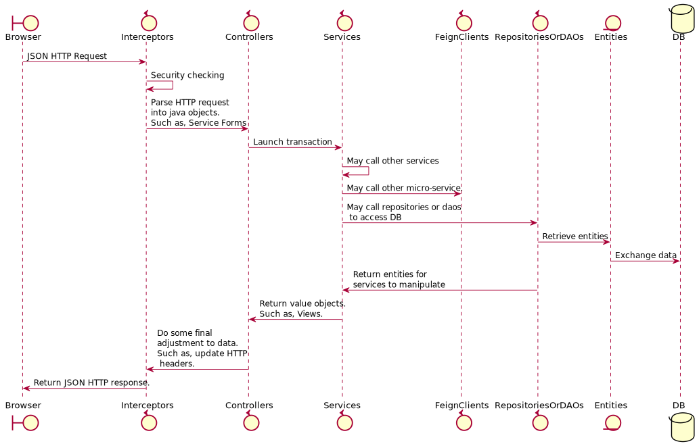

<h1><p style="text-align: center;">Backend Programming Guide</p></h1>

Table of content:
[TOC levels=2-4]

## Overview
This document introduce technical detail about backend programming. It introduce how to implement each
type of technical components and coding standard. Developers who are new to this project should go through
this document first before doing any backend service development tasks.


## Components For Tasks 

When developer want to create a new backend service for new functions, below types of technical components 
will be touched:

* Controllers - Controllers are used to expose HTTP REST endpoints that can be accessed by other services or frontend
program. It implement the C layer of MVC pattern. Usually, it call Services to conduct transactions or retrieve data.
It may transform the data that is retrieved from Services into a format that can be understood by the caller 
(such as an browser based frontend application). Usually, Controllers accept request or generate response in JSON
 format(except for the scenarios that need to handle binary data. Such as file upload, generate PDF).
* Services - Services are used to implement business logic. It call other Services, Repositories or Daos to manipulate 
data in DB. Transaction control should be done in this layer. 
* Repositories - Spring data is used in this project. Compare with traditional Daos, Spring data can save effort if
developer just need some simple DB access method. For example, Spring data can provide repositories with default 
CRUD method for one entity. Developer do not need to code any implementation. Spring data
also can generate implementation for simple query method for one entity by parsing method names. Developer just need 
to define that method in repositories interface. Spring data repositories only can be used to do DB access for one
entity only.
* Daos - In some scenarios, complicated DB access is needed for some reasons. For example, some query functions may 
have performance issue if "join table" is not used. In these scenarios, Daos will be used. Daos are used to handle the 
scenario that need cross-table or cross-entity DB access.
* Entities - JPA(Implemented with Hibernate) is used for DB access in this project. All DB access should be done through 
JPA entity except for some special scenarios. For example, an legacy store procedure must be reused becauuse it is too 
expensive to rebuild it in java. In this case, developer should call JPA EntityManager to access that store procedure. 
Developer should never by pass JPA(anyway, multiple technologies for one purpose is always not good for application 
maintenance) until something really cannot be done with JPA or it will cause other issues.
Please note that, Services, Repositories, Daos and Entities are belong to the M layer of MVC pattern.
* Service Forms - In some cases, there are many input fields for one transaction. For example, 10 fields need to be 
input to create an order. It is not a good practise to define those 10 fields as parameters for methods in Controllers
and Services. An Service Form should be defined for these 10 fields and use this Service Form as parameters for methods
in Controllers or Services. Basically, Service Forms are values objects for passing values only. It should not include 
any logic. Service Forms are used to contain JSON data that is parsed from body in a PUT/POST HTTP requests as well
 (please see 
[@RequestBody usage](https://docs.spring.io/spring/docs/4.3.10.BUILD-SNAPSHOT/spring-framework-reference/htmlsingle/#mvc-ann-requestbody))  
. In this case, the fields definition in Service Forms should match the format of JSON from frontend program. So, 
Service Forms are used to defined the interface between frontend and backend programs.
* Views - It is similar to Service Forms, Views are values objects and they are used to defined the interface
between frontend and backend. Different from Service Forms that are used as input for Controllers or Services
, Views are used as output. For example, there is a complicated query function need to retrieve 10 fields from 3 tables.
An View class that include 10 fields. Services should call Repositories/Daos to retrieve data to fill that View object
and return it to Controllers. Controllers will return this View object with annotation 
[@ResponseBody](https://docs.spring.io/spring/docs/4.3.10.BUILD-SNAPSHOT/spring-framework-reference/htmlsingle/#mvc-ann-responsebody)   
to generate JSON to response frontend program. Basically, Views are used to show data in screens and Service Forms are 
used to submit data. Sometimes, the no of fields shown in screens are more than the no of fields that will be 
submitted in the same screen. For example, in an user editing screen, the role for a user can be choosed. 
The screen need to show the role code and role description. However, when submit button is clicked, only role code 
need to be submitted. In this case, the View class may extend the Service Form class.
* Feign Clients - In micro-service architecture, backend services are deployed into different processes so that cross 
processes communication is needed. Besides the cross processes communication happen in production env, the API testing
(subcutaneous test) also need cross processes communication. The reason is the test case is deployed in an separated process. 
 They communicate with the APIs that are being tested by sending HTTP request(simulate the behaviour of frontend 
 program). In this project, Feign Clients are used for this kind of communication. With Feign Client, developer do not
 need to construct the HTTP request manually which may cause typo mistake easily and is not refactoring friendly.
Developer just need to make sure the methods definitions is exactly the same as the ones in 
Controllers in target process. Then, the Feign Clients can construct proper HTTP request to call the target REST API. 
Besides used as an remote communication channel, Feign Clients also provide load balancing features with 
[Ribbon](http://cloud.spring.io/spring-cloud-static/Dalston.SR4/single/spring-cloud.html#spring-cloud-ribbon).
For simple application, the IP/ports for remote processes can be written in property file. When more and more processes
are involved, it is difficult to use property file to maintain the IP/ports list. To handle this case, Feign Clients 
also can be integrated with 
[Eureka](http://cloud.spring.io/spring-cloud-static/Dalston.SR4/single/spring-cloud.html#spring-cloud-eureka-server) 
for service registration which is widely used in micro-service architecture. 


When an HTTP request is sent to a backend service, this request is handled as below:


**Note**: Because Interceptors are not touched for tasks usually, they are not mentioned in the list above. However,
to illustrate the overall process, it is mentioned in the diagram above.

Below diagram illustrate the relationship between the components mentioned above:


 
### Controllers
Controllers are used to provide HTTP endpoint so that services can be access by components in other processes. 
Most of the Controllers provide JSON endpoints. For these Controllers, `@RestController` should be placed before the 
class name. If `@RestController` is not used but just use `@ResponseBody` and `@Controller`, the JSON endpoint still
work. However, the exception handling will not be done properly because the globally exception handler for JSON endpoints
use `@RestController` to indicate which Controllers are under its control.

For each methods in Controllers that are used to provide HTTP endpoints, `@RequestMapping` must be used. The url for
the HTTP endpoint can be specified in `@RequestMapping`. The naming convention of url should be 
"/{an noun or an noun phrase}/{an verb phrase}".


For Controllers methods that do query only, GET request method should be used. For Controllers methods that are used 
to submitted data(such as
submit a form), POST request method should be used. For Controllers methods that are used to delete something(such as,
inactive an account), DELETE request method should be used.   

If only simple data (such as, there are only 2 fields) is passed to the HTTP endpoint as input, HTTP request parameters
should be used. `@RequestParam` should used to map the HTTP request parameters to java method parameters. 
If compliated data (such as, complicated form data that is in tree structure ) is passed to the HTTP endpoint as input,
the data should be passed through HTTP request body. `@RequestBody` should be used to map the data in HTTP request body
to an ServiceForm object. There are no request body for GET/DELETE request, it is impossible to use `@RequestBody` 
for the endpoints with GET/DELETE request methods. If an HTTP endpoint really need to use `@RequestBody` for some 
reasons, this endpoint should use POST request method. For example, there is an endpoint used to inactive an account. 
Base on the rule above, DELETE request method should be used. However, inactive an account is not that simple. User need
to key in a complicated form for audit reason(such as justify why this account should be inactive). It is trouble to
handle this form data without `@RequestBody`. In this case, this endpoint should used `@RequestBody` and POST request
method.

Below are some example:
```java
    //method that do query. Please note that, the value of @RequestParam should be specified. It is not an good practise
    //to let Spring MVC to guess the value for @RequestParam base on the java method parameter name since it is not
    //refracting friendly. 
    // View is used as returned object to generate JSON here.
    @RequestMapping(value = "/user/queryUser", method = RequestMethod.GET)
    public List<UserQueryView> queryUser(@RequestParam("userName") String userName, 
                                         @RequestParam("userDesc") String userDesc) {
        //...
    }
     
    //method that accept form data to create an user in system. @RequestBody is used here.
    //ServiceForm object is used as method parameter here.
    @RequestMapping(value = "/user/createUser", method = RequestMethod.POST)
    public Boolean createUser(@RequestBody UserServiceForm user) {
        //...
    }
    
    //delete an user. Because only one field is needed, @RequestParam and DELETE request method is used here.
    @RequestMapping(value = "/user/deleteUser", method = RequestMethod.DELETE)
    public Boolean deleteUser(@RequestParam("userName") String userName) {
            //...
    }
    
    //Inactive an account. Since complicated input data is needed. @RequestBody and POST request method is used here.
    @RequestMapping(value = "/account/inactiveAccount", method = RequestMethod.POST)
    public Boolean deleteUser(@RequestBody InactiveAccountServiceForm serviceForm) {
            //...
    }
    
 ```
 
In some cases, non-JSON HTTP endpoints are needed. Such as, upload a file, download PDF from server side. In these
cases, `@Controller` should be used to create Controllers classes. `@ResponseBody` should not be used as well because
it will make the endpoint generate JSON response.

For security reason, `@PreAuthorize` should be used at the beginning of every Controllers methods. This annotation
is used to tell Spring Security framework what access right that is needed to access this endpoint.
For the endpoints that only can be access by authorized users, `@PreAuthorize` should be used as below:
```java
    @RequestMapping(value = "/user/queryAllUsers", method = RequestMethod.GET)
    @PreAuthorize("hasPermission('query_all_users', '')")
    public List<User> queryAllUsers() {
        //...
    }
```
The first parameter of "hasPermission" is the name of function point. Please refer "Security" section about how to
config function point and assign them to users. The second parameter should be 'AUTHORIZED'.
If the endpoint can be access by all authenticated user, the first parameter should be '' and the second parameter
should be 'AUTHENTICATED'. 

### Naming Convention

#### Java Classes
The name of java classes should be a noun or a noun phrase. All java methods should be an verb or verb phrase.

#### Controllers
The naming convention is "{An Noun or an noun phrase} + Controler". They should be placed at a package with naming
pattern "**/controller".
